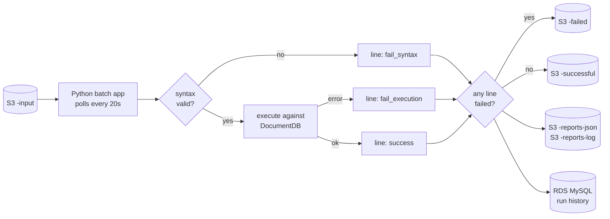

# mongo-dcu-pipeline

**MongoDB Document Change Utility** — a batch pipeline that validates files of MongoDB queries and promotes them from QA to Production through a hash-and-token gate.

A file arrives in S3 containing one MongoDB query per line. The application picks it up, validates every line — first for syntax, then by executing it against DocumentDB — and routes the whole file to a success or failure bucket based on the result. A file that passes in QA earns a one-time promotion token; only that exact file, byte for byte, can then be run against Production.

The project is a working demonstration of a multi-environment AWS deployment: infrastructure as code, containerisation, orchestration, CI/CD, observability, and secrets management — built to be provisioned and torn down repeatedly rather than left running.

## How it works



Syntax is checked before anything reaches the database, so a malformed line never executes. A single failed line fails the whole file — but the per-run report pinpoints exactly which line failed and why, so the file can be corrected and resubmitted rather than rebuilt.

## Environments

| Environment | Runs on | Purpose |
|---|---|---|
| `dev` | Local Docker Compose (MongoDB + MySQL containers, real S3) | Fast iteration on application logic |
| `qa` | AWS — dedicated EKS cluster, DocumentDB, shared RDS | Real validation runs; safe to repeat |
| `prod` | AWS — separate EKS cluster and DocumentDB | Only ever receives a QA-validated, token-gated file |

## Promotion gate

A file reaches Production only if all of the following hold: its SHA-256 matches a QA run that succeeded completely, the accompanying token is the one that run generated, the token has not been used, and it has not expired (24 hours). Any check failing is a hard failure with no file copied.

## Stack

Python · Docker · Terraform · Ansible · Helm · Kubernetes (EKS) · Jenkins · AWS (DocumentDB, RDS, S3, ECR, Secrets Manager, SES, CloudWatch, VPC endpoints) · Prometheus · Grafana · Splunk

## Repository layout

```
app/          Python application source
terraform/    modules/ and environments/ (bootstrap, dev, qa, prod, shared)
ansible/      cluster configuration, secrets bridging, database seeding
helm/         the application's chart
jenkins/      declarative pipelines, one per job
scripts/      provisioning, status, and teardown tooling
sql/          RDS schema
seed/         DocumentDB seed data
samples/      example query files
docs/         architecture, runbooks, per-service notes
```

## Cost discipline

The AWS footprint runs at roughly $0.53/hour while up and is torn down after every session. `scripts/status.sh` reports everything tagged `project=mongo-dcu-pipeline`; `scripts/nuke.sh` removes it independently of Terraform state, as a backstop for anything a destroy missed.

## Status

Under active construction — see `docs/` for what is in place.
