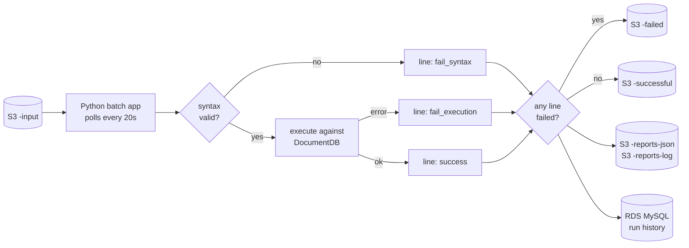

# mongo-dcu-pipeline

**MongoDB Document Change Utility** — a batch pipeline that validates files of MongoDB queries and promotes them from QA to Production through a hash-and-token gate.

A file arrives in S3 containing one MongoDB query per line. The application picks it up, validates every line — first for syntax, then by executing it against DocumentDB — and routes the whole file to a success or failure bucket based on the result. A file that passes in QA earns a one-time promotion token; only that exact file, byte for byte, can then be run against Production.

The project is a working demonstration of a multi-environment AWS deployment: infrastructure as code, containerisation, orchestration, CI/CD, observability, and secrets management — built to be provisioned and torn down repeatedly rather than left running.

## How it works



Syntax is checked before anything reaches the database, so a malformed line never executes. A single failed line fails the whole file — but the per-run report pinpoints exactly which line failed and why, so the file can be corrected and resubmitted rather than rebuilt.

## Environments

| Environment | Runs on | Purpose |
|---|---|---|
| `dev` | Local Docker Compose (MongoDB + MySQL containers, real S3) | Fast iteration on application logic |
| `qa` | AWS — dedicated EKS cluster, DocumentDB, shared RDS | Real validation runs; safe to repeat |
| `prod` | AWS — separate EKS cluster and DocumentDB | Only ever receives a QA-validated, token-gated file |

## Promotion gate

A file reaches Production only if all of the following hold: its SHA-256 matches a QA run that succeeded completely, the accompanying token is the one that run generated, the token has not been used, and it has not expired (24 hours). Any check failing is a hard failure with no file copied.

## Stack

Python · Docker · Terraform · Ansible · Helm · Kubernetes (EKS) · Jenkins · AWS (DocumentDB, RDS, S3, ECR, Secrets Manager, SES, CloudWatch, VPC endpoints) · Prometheus · Grafana · Splunk

## Repository layout

```
app/          Python application source
terraform/    modules/ and environments/ (bootstrap, dev, qa, prod, shared)
ansible/      cluster configuration, secrets bridging, database seeding
helm/         the application's chart
jenkins/      declarative pipelines, one per job
scripts/      provisioning, status, and teardown tooling
sql/          RDS schema
seed/         DocumentDB seed data
samples/      example query files
docs/         architecture, runbooks, per-service notes
```

## Cost discipline

The AWS footprint runs at roughly $0.57/hour fully up and is torn down after every session; qa and the data tier without a cluster are about $0.154/hour.

| Script | Does |
|---|---|
| `scripts/status.sh` | Every resource, what it costs per hour, and a warning if anything billable is up |
| `scripts/nuke.sh` | Force-deletes everything independently of Terraform state. `--dry-run` first, always |
| `scripts/teardown.sh` | The enforced sequence: status → destroy → status → nuke → status |

The state bucket, the container registry and the analytics bucket are on an
explicit protection list. They carry the same project tag as everything else,
and deleting the state bucket would not remove the resources it describes - it
would remove the only record that they exist.

## Documentation

| Document | Covers |
|---|---|
| [docs/QUERY-FORMAT.md](docs/QUERY-FORMAT.md) | The query file format and all five validation checks |
| [docs/DOCKER.md](docs/DOCKER.md) | The local development stack and the application image |
| [docs/TERRAFORM.md](docs/TERRAFORM.md) | Stack layout, remote state, the S3 module, the dev scripts |
| [docs/ECR.md](docs/ECR.md) | The container registry, the image tagging scheme, and how the cluster pulls |
| [docs/DOCUMENTDB.md](docs/DOCUMENTDB.md) | The cluster, the enforced-TLS connection string, and the query subset |
| [docs/RDS-MYSQL.md](docs/RDS-MYSQL.md) | The shared instance, why it has its own stack, and how three networks reach it |
| [docs/validation/](docs/validation/README.md) | Step-by-step checks for each completed phase |
| [docs/ISSUES.md](docs/ISSUES.md) | Problems hit while building, what caused them and how they were fixed |

## Status

Under active construction. Working today: the query parser and validator, the
application runtime, the local Docker Compose stack, the Terraform remote state
backend, the dev S3 environment with its create, destroy, status and nuke
scripts, and the shared stack holding the ECR repository the cluster will pull
from. A file dropped into the dev input bucket is validated, executed against a
local MongoDB, routed to the success or failure bucket, reported on in two
formats and recorded in MySQL; the same image that does it is built and pushed
to ECR by `scripts/build-push.sh`.

Also working: the qa AWS environment - a private VPC with no internet route,
six VPC endpoints in place of a NAT gateway, a DocumentDB cluster, and a shared
MySQL instance in its own stack, peered in, so that destroying qa cannot take
prod's run history with it.

Still to come: EKS, the Helm chart, the QA to production promotion gate,
observability, Splunk, and the Jenkins pipelines.
