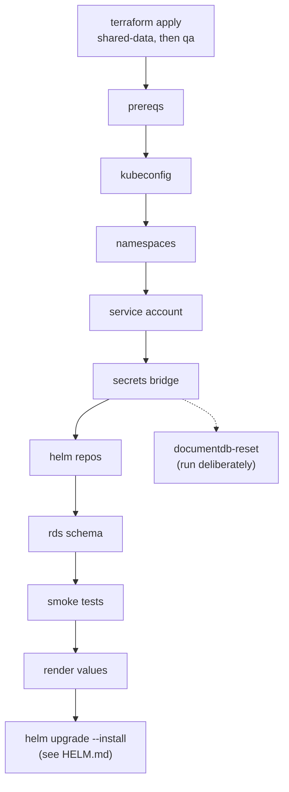

# Ansible

Everything between `terraform apply` finishing and a Helm chart being
installable: kubeconfig, namespaces, the service account, copying credentials
from Secrets Manager into the cluster, the MySQL schema, seeding DocumentDB,
and connectivity checks that fail before a deploy instead of after it.

All of it runs on this machine. There is no server to configure - the cluster
is managed through its API, the databases through their endpoints.

## Variables used on this page

```bash
export PROJECT_ROOT=~/Documents/PROJECTS/mongo-dcu-pipeline
export PROJECT=mongo-dcu-pipeline
export AWS_REGION=us-east-1
export ENV=qa
```

| Variable | Example value | Where it comes from |
|---|---|---|
| `PROJECT_ROOT` | `~/Documents/PROJECTS/mongo-dcu-pipeline` | Wherever you cloned the repository |
| `PROJECT` | `mongo-dcu-pipeline` | Fixed |
| `AWS_REGION` | `us-east-1` | Fixed |
| `ENV` | `qa` | Your choice: `qa` or `prod`. Passed to every playbook as `-e target_env=$ENV` |

The playbooks themselves take nothing else from you. Endpoints, secret names,
the IRSA role ARN and the image tag are **generated** - read at run time from
Terraform outputs and the registry by `tasks/load-context.yml` - so none of
them appears in a variable file.

## Setup, once

Ansible's own Python (the system one) has none of the libraries the AWS,
Kubernetes and MySQL modules import. The inventory points module execution at
the project's virtual environment instead:

```bash
cd $PROJECT_ROOT
.venv/bin/pip install -r ansible/requirements.txt
ansible-galaxy collection install -r ansible/requirements.yml
```

Then confirm:

```bash
cd $PROJECT_ROOT/ansible && ansible-playbook playbooks/prereqs.yml
```

## Running

From the `ansible/` directory, so `ansible.cfg` is picked up:

```bash
# variable form
cd $PROJECT_ROOT/ansible && ansible-playbook playbooks/configure-cluster.yml -e target_env=$ENV

# expanded
cd ~/Documents/PROJECTS/mongo-dcu-pipeline/ansible && ansible-playbook playbooks/configure-cluster.yml -e target_env=qa
```

Order is fixed: apply `shared-data`, apply the environment, then this.

## The playbooks

| Playbook | Design item | Does |
|---|---|---|
| `prereqs.yml` | 1 | Tools, their versions, the Python libraries, the AWS caller. Checks only - installing system packages needs root, and a playbook that quietly runs sudo is one nobody should trust |
| `kubeconfig.yml` | 2 | `aws eks update-kubeconfig --alias`, then waits for the API and for 2 Ready nodes |
| `namespaces.yml` | 3 | The application namespace (Pod Security `restricted`) and `monitoring` |
| `service-account.yml` | - | The application's service account, annotated with its IRSA role |
| `secrets-bridge.yml` | 4 | Secrets Manager to Kubernetes Secrets |
| `helm-repos.yml` | 5 | `prometheus-community` and `grafana` |
| `documentdb-reset.yml` | 6 | Drop, reindex, reseed - as a Job inside the cluster |
| `rds-schema.yml` | 7 | `sql/schema.sql` against the shared MySQL instance, from this machine |
| `smoke-tests.yml` | 8 | Checks from this machine, then thirteen checks from a pod |
| `render-values.yml` | 9 | `ansible/generated/values-<env>.yaml` for the Helm chart |
| `status.yml` | 10 | One JSON status document, the counterpart to `status.sh` |
| `configure-cluster.yml` | - | 1-5, 7, 8 and 9 in dependency order. The `-02-configure-cluster` Jenkins job |

`documentdb-reset.yml` is not in `configure-cluster.yml`. Reseeding is a
decision - it destroys whatever a test run left in the collection - so it is
its own job (`-11-documentdb-reset`) and is run deliberately.



## The secrets bridge

Secrets Manager is the source of truth; the pod mounts Kubernetes Secrets.
The bridge also reshapes each one into the exact environment
variable names `app/config.py` reads, so the chart can mount a Secret with
`envFrom` and no key mapping.

| Secrets Manager | Kubernetes Secret | Keys |
|---|---|---|
| `mongo-dcu-pipeline/qa/docdb` | `mongo-dcu-pipeline-docdb` | `MONGO_URI` |
| `mongo-dcu-pipeline/shared/rds` | `mongo-dcu-pipeline-rds` | `MYSQL_HOST`, `MYSQL_PORT`, `MYSQL_USER`, `MYSQL_PASSWORD`, `MYSQL_DATABASE` |
| `mongo-dcu-pipeline/qa/ses` | `mongo-dcu-pipeline-ses` | `SES_SENDER`, `SES_RECIPIENTS` |

Three decisions in it:

- **`no_log` on every task that holds a value.** A failing task prints its
  arguments and results, and in Jenkins that output is a build log anyone with
  job access can read.
- **Replace, not apply.** A kubectl-style apply stores the whole object -
  values included - in a `last-applied-configuration` annotation, readable by
  anyone allowed to read metadata. The cost is that the task always reports
  `changed`.
- **Each Secret records the source version** it was copied from, in the
  `mongo-dcu-pipeline/source-version` annotation, so a copy that is stale
  after a credential changes can be spotted:

```bash
kubectl --context $PROJECT-$ENV -n $ENV get secret $PROJECT-docdb \
  -o jsonpath='{.metadata.annotations.mongo-dcu-pipeline/source-version}{"\n"}'
aws secretsmanager describe-secret --secret-id $PROJECT/$ENV/docdb --region $AWS_REGION \
  --query 'VersionIdsToStages' --output json

# expanded
kubectl --context mongo-dcu-pipeline-qa -n qa get secret mongo-dcu-pipeline-docdb \
  -o jsonpath='{.metadata.annotations.mongo-dcu-pipeline/source-version}{"\n"}'
aws secretsmanager describe-secret --secret-id mongo-dcu-pipeline/qa/docdb --region us-east-1 \
  --query 'VersionIdsToStages' --output json
```

## Jobs inside the cluster

DocumentDB has no public endpoint, so anything that talks to it from Ansible
has to run inside the VPC. `tasks/run-job.yml` runs one Kubernetes Job from the
application image - which already carries pymongo, PyMySQL, boto3 and the TLS
certificate bundle - with a script mounted from a ConfigMap. It is the
in-cluster equivalent of the bind mount the Compose `seed` service uses
locally.

Every Job meets the `restricted` Pod Security Standard the namespace enforces:
non-root by number, no privilege escalation, every capability dropped, a
read-only root filesystem, the runtime's seccomp profile. The application's
Helm chart meets the same standard, and its pod passed the same admission in
Phase 8 - a Job admitted here was early evidence it would.

## Why the schema is applied from this machine

`rds-schema.yml` connects to MySQL over its public endpoint, restricted to this
machine's address, rather than from a pod. The Phase 9 promotion gate is checked
by Jenkins from here, so this is the path that has to work - applying the
schema over it proves it every session. The playbook compares the admin rule
with your current address first and says which stack to reapply when a home
address has changed.

It uses a short PyMySQL script (`files/apply_schema.py`) rather than
`community.mysql.mysql_db`, whose import mode shells out to the `mysql` client
this project does not install. `community.mysql.mysql_query` then confirms the
three tables exist.

## The smoke tests

From this machine: the Kubernetes API answers, 2 nodes are Ready, CoreDNS is
available, MySQL's public endpoint accepts a connection.

From a pod, running as the application's service account with the
application's Secrets:

| Check | Proves |
|---|---|
| DocumentDB name resolves to a private address | VPC DNS |
| DocumentDB port reachable | Security group |
| DocumentDB TLS and ping | The CA bundle in the image, and `tls=true` |
| DocumentDB write | `retryWrites=false` - wrong, it fails on the first write, not on connect |
| MySQL name resolves privately | DNS resolution across the peering connection |
| MySQL port reachable | Routes in both directions, and the security group |
| MySQL schema present | `rds-schema.yml` ran against the instance the pod reaches |
| IRSA identity | Service account annotation, trust policy, `sts` endpoint, `AWS_DEFAULT_REGION` (issue 17) |
| Own input bucket readable | The IAM policy, and the S3 gateway endpoint |
| Another environment's bucket denied | The policy is scoped to one environment |
| Own secret readable | The Secrets Manager endpoint and policy |
| SES API reachable | The `email` endpoint, and that it answers the hostname boto3's SES client calls (issue 20) |
| Node role credentials unreachable | The launch template's metadata hop limit |

Each check prints one JSON line; the playbook reads them back from the pod log
and fails naming every check that did not pass.

## Generated files

`ansible/generated/` is gitignored. Everything in it is rebuilt from the
current apply:

| File | Written by |
|---|---|
| `values-<env>.yaml` | `render-values.yml` |
| `status.json` | `status.yml` |
