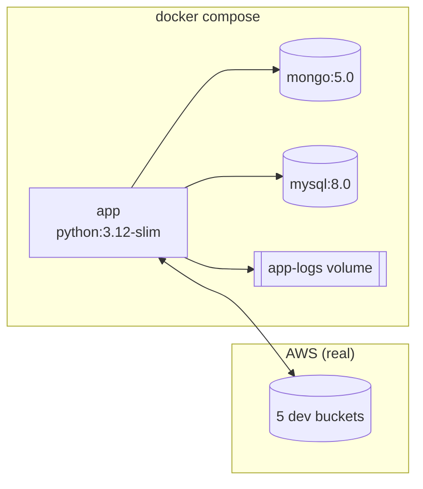

# Local development stack

MongoDB and MySQL run as containers standing in for DocumentDB and RDS. **S3 is
the real thing** - the dev buckets in the AWS account. File pickup, the
copy-then-delete move between buckets and report upload are the paths most
likely to behave differently against a stand-in, and storage for a few small
text files costs a fraction of a cent per month, so there is nothing to gain
from faking them.



## First run

```bash
# variable form
cd $PROJECT_ROOT
./scripts/dev-s3-create.sh                 # if the buckets are not up
cp .env.example .env
docker compose up -d --build
docker compose run --rm seed               # 100 documents into MongoDB

# expanded
cd ~/Documents/PROJECTS/mongo-dcu-pipeline
./scripts/dev-s3-create.sh
cp .env.example .env
docker compose up -d --build
docker compose run --rm seed
```

Bucket names for `.env` come straight from Terraform rather than being typed:

```bash
terraform -chdir=terraform/environments/dev output -raw env_file_lines
```

## Everyday commands

| Command | Does |
|---|---|
| `docker compose up -d --build` | Start, rebuilding the app image |
| `docker compose logs -f app` | Follow the pipeline's narrative |
| `docker compose run --rm seed` | Reset `properties`: drop, reindex, reload 100 documents |
| `docker compose exec app tail -f /var/log/mongo-dcu/app.log` | The file Splunk monitors |
| `curl -s localhost:9090/metrics` | The Prometheus endpoint |
| `docker compose stop app` | Graceful SIGTERM - it finishes the current file first |
| `docker compose down -v` | Stop and discard the local databases |

Send a file through:

```bash
# variable form
aws s3 cp samples/all-good.txt s3://$S3_INPUT_BUCKET/
./scripts/dev-s3-status.sh

# expanded
aws s3 cp samples/all-good.txt s3://mongo-dcu-pipeline-dev-input-950639281723/
./scripts/dev-s3-status.sh
```

Within one polling cycle the file leaves `-input` for `-successful` or
`-failed`, both reports appear, and the rows land in MySQL:

```bash
docker compose exec mysql mysql -u mongo_dcu -pdevpassword mongo_dcu \
  -e "SELECT file_name, status, total_lines, success_count FROM runs ORDER BY started_at;"
```

## The image

`python:3.12-slim`, pinned rather than following latest: the point of pinning
is that QA and production run the same interpreter every time, regardless of
what any developer machine happens to have. The local virtual environment runs
3.14 and the tests pass on both.

Dependencies are installed in their own layer before the application code is
copied, so a code change - which happens on every commit - reuses the cached
dependency install.

The healthcheck is the metrics endpoint, requested with Python rather than
curl. The slim image has no curl, and adding one purely for a healthcheck means
carrying it in production for the life of the image. The endpoint is served by
the same process that runs the polling loop, so a process that has stopped
answering here has stopped polling too.

### Two things that bite, and why they are solved this way

**The container user id is a build argument.** The container runs as a non-root
user, and local development mounts two host paths into it: `~/.aws`, which is
mode 0600 and readable only by its owner, and the logs directory it has to
write to. A container uid that does not match the host user can read neither -
mounting the credentials read-only does not help, because the file's own
permissions still apply. Compose therefore builds with the host's uid:

```yaml
build:
  args:
    APP_UID: ${APP_UID:-1000}
    APP_GID: ${APP_GID:-1000}
```

Check yours with `id -u && id -g`, and set `APP_UID`/`APP_GID` in `.env` if it
is not 1000. CI builds take the default. `HOME` is set explicitly in the image
so the AWS SDK resolves `~/.aws` to the same path whether or not the runtime
overrides the user.

**Logs go to a named volume, not a bind mount.** A host directory that Docker
creates on first run is owned by root, and a non-root container then cannot
write to it - which is a confusing failure, because the application starts
fine and only the log file is missing. The `app-logs` volume avoids it
entirely, and the Splunk service mounts the same volume: the local equivalent
of the `emptyDir` it shares with the app pod in QA and production.

## Configuration

Every setting is an environment variable, and the application reads nothing
else. Locally they come from `.env`; in QA and production from a ConfigMap and
Kubernetes Secrets. The application does not know which.

Configuration is validated at startup and the process refuses to start if
anything is missing, listing **every** problem rather than the first - a
misconfigured deployment is then fixed in one pass instead of one restart at a
time.

Connectivity is proved at startup too: all five buckets are checked with
`head_bucket`, MongoDB is pinged and MySQL is queried. A wrong endpoint or a
missing permission is a clear message in the first seconds of the pod's life,
when somebody is watching, rather than twenty minutes later when a file
arrives.

## Running the tests

The parser and validator do no I/O, so they need none of this stack:

```bash
# variable form
cd $PROJECT_ROOT && .venv/bin/python -m pytest

# expanded
cd ~/Documents/PROJECTS/mongo-dcu-pipeline && .venv/bin/python -m pytest
```
