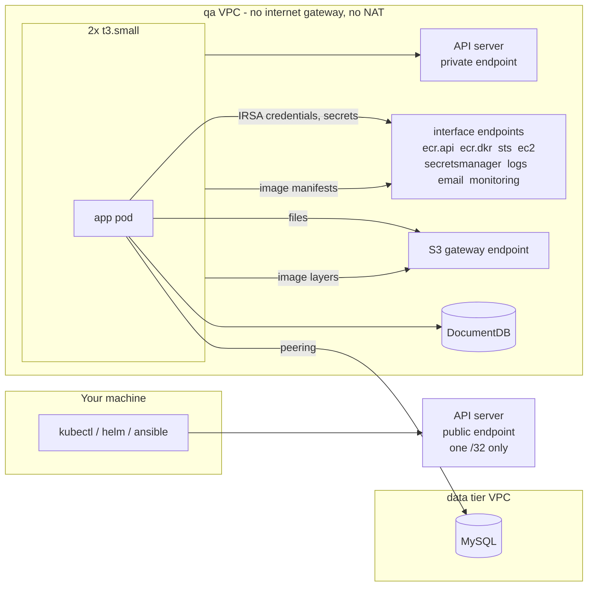

# Kubernetes (EKS)

One EKS cluster per environment, in a VPC with no route to the internet. This
page covers how the cluster is shaped, how it reaches the AWS services it
needs without a NAT gateway, and the three separate identities involved.

## Variables used on this page

```bash
export PROJECT_ROOT=~/Documents/PROJECTS/mongo-dcu-pipeline
export PROJECT=mongo-dcu-pipeline
export AWS_REGION=us-east-1
export ENV=qa
export CLUSTER_NAME=$PROJECT-$ENV
export NAMESPACE=$ENV
```

| Variable | Example value | Where it comes from |
|---|---|---|
| `PROJECT_ROOT` | `~/Documents/PROJECTS/mongo-dcu-pipeline` | Wherever you cloned the repository |
| `PROJECT` | `mongo-dcu-pipeline` | Fixed |
| `AWS_REGION` | `us-east-1` | Fixed |
| `ENV` | `qa` | Your choice: `qa` or `prod` |
| `CLUSTER_NAME` | `mongo-dcu-pipeline-qa` | Derived: `$PROJECT-$ENV` |
| `NAMESPACE` | `qa` | Derived: the environment's name, because each environment has its own cluster |

**Generated, not chosen** - read these, never type them:

| Value | Example shape | How to read the real one |
|---|---|---|
| API server endpoint | `https://4F1C8A903B2E4D179C551E0A7F6B2D84.gr7.us-east-1.eks.amazonaws.com` | `terraform -chdir=$PROJECT_ROOT/terraform/environments/$ENV output -raw cluster_endpoint` |
| OIDC issuer | `oidc.eks.us-east-1.amazonaws.com/id/4F1C8A903B2E4D179C551E0A7F6B2D84` | `aws eks describe-cluster --name $CLUSTER_NAME --query cluster.identity.oidc.issuer --output text` |
| IRSA role ARN | `arn:aws:iam::950639281723:role/mongo-dcu-pipeline-qa-app` | `terraform -chdir=$PROJECT_ROOT/terraform/environments/$ENV output -raw irsa_role_arn` |
| Node names | `ip-10-10-3-117.ec2.internal` | `kubectl get nodes` - the node's private address, assigned at launch |
| `admin_cidr` | `108.45.138.62/32` | Your public address, detected at apply time |

## Shape

| Setting | Value | Why |
|---|---|---|
| Kubernetes | 1.36 | Pinned, so a new EKS default cannot change the cluster between sessions |
| Nodes | 2 x `t3.small`, Amazon Linux 2023, fixed size | Two for resilience, not capacity: a failed node's pod is rescheduled in about a minute |
| Add-ons | `vpc-cni`, `kube-proxy`, `coredns`, as managed add-ons | Versions recorded by Terraform, not installed silently at creation |
| Authentication | Access entries (`API` mode) | Cluster access is an AWS resource, not an in-cluster ConfigMap a bad edit can lock you out of |
| Upgrade policy | `STANDARD` | A version leaving standard support is upgraded rather than moved to extended support at $0.60/hr |
| API endpoint | Private **and** public, public limited to one `/32` | Nodes use the private side; kubectl, Helm and Ansible run on your machine |
| Control plane logs | Off | Billed per GB, and EKS creates the log group outside Terraform where a destroy leaves it behind |

Cost: $0.10/hr for the control plane plus $0.0208/hr per node - **$0.142/hr**
on top of the $0.174/hr the rest of qa and the data tier cost - **$0.316/hr** in
all, plus a few cents an hour of Container Insights observations
([PROMETHEUS-GRAFANA.md](PROMETHEUS-GRAFANA.md#cost)).

## How a cluster works with no internet route



Every one of these paths has failed somebody's cluster in a way that looked
like something else:

| Path | Needs | If it is missing |
|---|---|---|
| Node registers with the cluster | Private API endpoint, VPC DNS support | Node group sits in `CREATING` for 20 minutes, then fails with `NodeCreationFailure` |
| Image pull | `ecr.api`, `ecr.dkr` **and** the S3 gateway (layers are stored in S3) | `ImagePullBackOff` with an i/o timeout |
| Pod gets an address | `ec2` endpoint (the VPC CNI calls the EC2 API) | Pods stuck in `ContainerCreating`, `aws-node` logs show EC2 timeouts |
| Pod gets IRSA credentials | `sts` endpoint, **and `AWS_DEFAULT_REGION` in the pod** - botocore ignores `AWS_REGION`, and with no region calls the global `sts.amazonaws.com` | The first AWS call hangs for minutes with no error (issue 17) |
| Pod reaches MySQL | Peering, routes both ways, DNS resolution across the peering | Name resolves to a public address and the connection times out |
| App sends the run summary email | `email` endpoint, whose private DNS answers `email.us-east-1.amazonaws.com` - the name boto3 calls | The first email hangs the polling loop behind it (issue 20) |
| Monitoring images pull | The ECR mirror, filled by `scripts/mirror-images.sh` - quay.io, Docker Hub and registry.k8s.io are unreachable | `ImagePullBackOff` on every monitoring pod |
| Grafana reads CloudWatch | `monitoring` endpoint, Grafana's IRSA role | CloudWatch panels time out |
| Container Insights agent reads instance metadata | The agent runs on the host network, so the hop limit of 1 does not stop it | No `ContainerInsights` metrics, no log group |

## Three identities

| Identity | Assumed by | Can do |
|---|---|---|
| `mongo-dcu-pipeline-qa-eks-cluster` | The EKS control plane | Manage the network interfaces and security groups the control plane needs |
| `mongo-dcu-pipeline-qa-eks-node` | Each node's EC2 instance | Join the cluster, pull images, let the CNI assign pod addresses |
| `mongo-dcu-pipeline-qa-app` | The `qa/mongo-dcu-pipeline-app` service account only | The application's own buckets, secrets and log group - nothing else |

Two things make the third one mean something:

- **The trust policy names one service account.** Both the `aud` and the `sub`
  conditions are set. Without `sub`, any service account in the cluster could
  assume the role.
- **Pods cannot borrow the node's role instead.** The launch template sets the
  instance metadata hop limit to 1. A pod is one network hop further from the
  metadata service than its node, so the response never reaches it. Without
  this, IRSA would be a formality: every pod could read the node role's
  credentials from `169.254.169.254`. The smoke tests check this from inside a
  pod.

The service account is created by Ansible, not the Helm chart - the binding
between it and the role is infrastructure, and a chart that could rename the
service account could silently break the only identity the role trusts.

## Namespaces

| Namespace | Pod Security | Holds |
|---|---|---|
| `qa` (or `prod`) | `restricted`, enforced | The application, its service account, its Secrets, and the Ansible Jobs |
| `monitoring` | Unlabelled | kube-prometheus-stack. node-exporter reads host paths and would be refused under `restricted` |
| `amazon-cloudwatch` | Unlabelled, created by the add-on | The CloudWatch agent (host network) and its controller |

`restricted` refuses a pod that runs as root, allows privilege escalation,
keeps any Linux capability, or lacks a seccomp profile. The application image
runs as a named user (`USER appuser`); the kubelet cannot prove a name is not
root, so every pod spec states `runAsUser: 1001` explicitly.

## Pods per node

The VPC CNI gives every pod a real VPC address, so the number of pods a node
can run is capped by how many addresses its network interfaces can hold:

```
max pods = interfaces x (addresses per interface - 1) + 2
t3.small = 3 x (4 - 1) + 2 = 11
```

Before anything of this project's is scheduled, each node runs `aws-node` and
`kube-proxy`, and the two CoreDNS replicas land on one node or the other.

Measured with everything up in Phase 10 - the system add-ons, the CloudWatch
agent and its controller, kube-prometheus-stack's seven pods and the
application - the cluster ran **17 pods of 22**, with **43-46% of each node's
memory available**. `t3.small` is enough; `t3.micro` (4 pods per node) never
was. An Ansible Job or two on top still fits.

## Commands

Point kubectl at the cluster:

```bash
# variable form
aws eks update-kubeconfig --name $CLUSTER_NAME --region $AWS_REGION --alias $CLUSTER_NAME

# expanded
aws eks update-kubeconfig --name mongo-dcu-pipeline-qa --region us-east-1 --alias mongo-dcu-pipeline-qa
```

Nodes, system pods, and the add-on versions EKS installed:

```bash
kubectl --context $CLUSTER_NAME get nodes -o wide
kubectl --context $CLUSTER_NAME get pods -A
aws eks list-addons --cluster-name $CLUSTER_NAME --region $AWS_REGION
aws eks describe-addon --cluster-name $CLUSTER_NAME --addon-name vpc-cni --region $AWS_REGION \
  --query 'addon.[addonVersion,status]' --output text

# expanded
kubectl --context mongo-dcu-pipeline-qa get nodes -o wide
aws eks describe-addon --cluster-name mongo-dcu-pipeline-qa --addon-name vpc-cni --region us-east-1 \
  --query 'addon.[addonVersion,status]' --output text
```

Who may use the cluster:

```bash
aws eks list-access-entries --cluster-name $CLUSTER_NAME --region $AWS_REGION

# expanded
aws eks list-access-entries --cluster-name mongo-dcu-pipeline-qa --region us-east-1
```

The service account and the role it is bound to:

```bash
kubectl --context $CLUSTER_NAME -n $NAMESPACE get serviceaccount $PROJECT-app \
  -o jsonpath='{.metadata.annotations.eks\.amazonaws\.com/role-arn}{"\n"}'

# expanded
kubectl --context mongo-dcu-pipeline-qa -n qa get serviceaccount mongo-dcu-pipeline-app \
  -o jsonpath='{.metadata.annotations.eks\.amazonaws\.com/role-arn}{"\n"}'
```

Launch-template settings on a running node (the hop limit):

```bash
aws ec2 describe-instances --region $AWS_REGION \
  --filters "Name=tag:eks:cluster-name,Values=$CLUSTER_NAME" \
  --query 'Reservations[].Instances[].[InstanceId,MetadataOptions.HttpTokens,MetadataOptions.HttpPutResponseHopLimit]' \
  --output table
```

## When something is wrong

| Symptom | First thing to check |
|---|---|
| `kubectl` times out, `aws eks` commands work | Your public address changed. Compare `terraform output eks_public_access_cidr` with `curl -s https://checkip.amazonaws.com`, then reapply the stack. `status.sh` warns about this |
| Node group fails with `NodeCreationFailure` | The endpoint list: `aws ec2 describe-vpc-endpoints --filters Name=vpc-id,Values=<vpc>` must show `ecr.api`, `ecr.dkr`, `ec2`, `sts` and the `s3` gateway |
| `ImagePullBackOff`, i/o timeout | The S3 gateway endpoint and its route table association |
| Pod has no AWS credentials | `AWS_WEB_IDENTITY_TOKEN_FILE` missing from the pod means the service account is not annotated, or the pod is not using it |
| First AWS call from a pod hangs, no error | `AWS_DEFAULT_REGION` missing. botocore is sending `AssumeRoleWithWebIdentity` to the global STS endpoint, which has no route from this VPC (issue 17) |
| AccessDenied on `AssumeRoleWithWebIdentity` | The namespace or service account name differs from the trust policy's `sub` condition |
| `violates PodSecurity "restricted"` | The pod spec. Usually `runAsUser`, `seccompProfile` or `capabilities.drop` |
