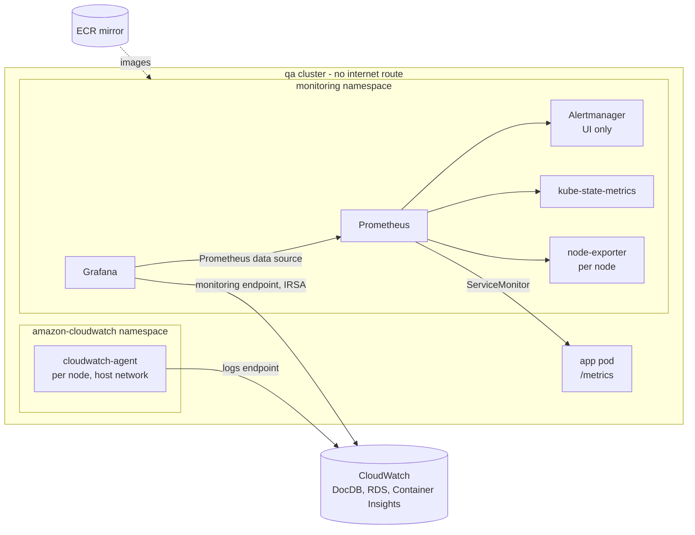
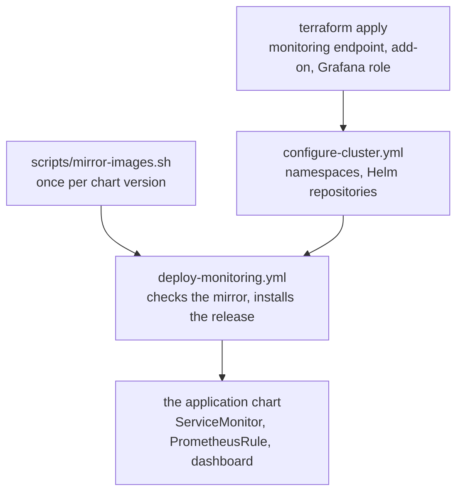

# Prometheus, Grafana and CloudWatch

Three layers, each covering what the others cannot see:

| Layer | Sees | Runs as |
|---|---|---|
| **Prometheus** | Pods, nodes, the Kubernetes API, and the application's own metrics | `kube-prometheus-stack`, a Helm release in the `monitoring` namespace |
| **CloudWatch** | DocumentDB and RDS, which expose nothing Prometheus can scrape; Container Insights for nodes and pods | The `amazon-cloudwatch-observability` EKS add-on, plus the managed services' own metrics |
| **Grafana** | Both, as two data sources, one dashboard per concern | Part of the Helm release |

Alertmanager shows alerts in its UI and in Grafana, and sends them nowhere
else.

## Variables used on this page

```bash
export PROJECT_ROOT=~/Documents/PROJECTS/mongo-dcu-pipeline
export PROJECT=mongo-dcu-pipeline
export AWS_REGION=us-east-1
export ENV=qa
export CLUSTER_NAME=$PROJECT-$ENV
export RELEASE=kube-prometheus-stack
```

| Variable | Example value | Where it comes from |
|---|---|---|
| `PROJECT_ROOT` | `~/Documents/PROJECTS/mongo-dcu-pipeline` | Wherever you cloned the repository |
| `PROJECT` | `mongo-dcu-pipeline` | Fixed |
| `AWS_REGION` | `us-east-1` | Fixed |
| `ENV` | `qa` | Your choice: `qa` or `prod`. Also the application's namespace |
| `CLUSTER_NAME` | `mongo-dcu-pipeline-qa` | Derived: `$PROJECT-$ENV`. Also the kubeconfig context |
| `RELEASE` | `kube-prometheus-stack` | Fixed: `monitoring_release` in `ansible/inventory/group_vars/all.yml`. Grafana's IAM role trusts a service account named after it |

**Generated, not chosen:**

| Value | Example shape | How it is produced |
|---|---|---|
| Grafana admin password | 40 characters | Generated by the chart at install. Read from the `kube-prometheus-stack-grafana` Secret - see below. Never in a values file |
| Grafana's IAM role ARN | `arn:aws:iam::950639281723:role/mongo-dcu-pipeline-qa-grafana` | `terraform -chdir=$PROJECT_ROOT/terraform/environments/$ENV output -raw grafana_role_arn` |
| Mirror registry | `950639281723.dkr.ecr.us-east-1.amazonaws.com/mongo-dcu-pipeline-mirror` | `terraform -chdir=$PROJECT_ROOT/terraform/environments/shared output -raw mirror_registry` |
| Pod names | `prometheus-kube-prometheus-stack-prometheus-0` | Kubernetes. Commands below use `svc/` and `deploy/` so none has to be typed |

## How it fits together



## What runs

`kube-prometheus-stack` 91.4.0, trimmed to what works on EKS
(`helm/monitoring/values.yaml`):

| Component | State | Why |
|---|---|---|
| Prometheus | 1 day retention, 1 GB cap, 384 Mi request | A session lasts hours. Durable run history is MySQL's |
| Alertmanager | Default config, no receivers | UI only - see [The alerts](#the-alerts) |
| Grafana | No persistence, update checks and avatars off | Dashboards and data sources come from ConfigMaps and values; there is no internet to check for updates on |
| kube-state-metrics, node-exporter | On | Pod and node state |
| etcd, scheduler, controller manager, kube-proxy scraping | **Off**, with their rules | The managed control plane is not reachable from the nodes. Scraping it produces targets that are down from the first minute and alerts that fire at install |
| Operator admission webhooks | **Off**, and operator TLS with them | Their certificate Job's image is on ghcr.io - a fourth public registry - and without that Job nothing creates the secret the operator's TLS needs. Rules are checked with promtool instead |

Seven pods. With the application, the system add-ons and the CloudWatch agent,
the two `t3.small` nodes ran **17 pods** of their 22 slots, with **43-46%** of
memory still available - `t3.small` is enough.

## The images come from ECR

Every image the release runs is copied into
`mongo-dcu-pipeline-mirror/<upstream path>` first, and `global.imageRegistry`
points the whole chart there. Details, and why a copy rather than a pull-through
cache, are in [ECR.md](ECR.md#the-mirror).

```bash
# variable form
$PROJECT_ROOT/scripts/mirror-images.sh --dry-run
$PROJECT_ROOT/scripts/mirror-images.sh

# expanded
~/Documents/PROJECTS/mongo-dcu-pipeline/scripts/mirror-images.sh --dry-run
```

Once per chart version. A chart upgrade that adds an image shows up as
`missing` in the dry run.

## CloudWatch: the add-on

Terraform, in `terraform/modules/observability/`. The add-on offers much more
than this project uses, and most of it is turned off:

| Setting | State | Why |
|---|---|---|
| `containerInsights` | on | Node and pod metrics in CloudWatch, with enhanced observability |
| `containerLogs` | off | Fluent Bit, a pod per node, for a copy of logs Splunk takes in Phase 11 |
| `applicationSignals` | off | Instruments application code; this application exposes its own metrics |
| `kubeStateMetrics`, `nodeExporter` | off | kube-prometheus-stack runs both - and two node-exporters want the same host port |
| `dcgmExporter`, `neuronMonitor` | off | GPU and Inferentia exporters, on nodes with neither |

That leaves three pods: a controller and one agent per node.

**The agent runs on the host network**, which matters here. The node launch
template sets the metadata hop limit to 1, so that pods cannot read the node's
credentials (see [KUBERNETES.md](KUBERNETES.md#three-identities)). The agent
needs instance metadata for its instance and region, and on the host network it
is not a hop further away - so Container Insights works without weakening the
hop limit for anything else. Checked live, not assumed:

```bash
kubectl --context $CLUSTER_NAME -n amazon-cloudwatch get daemonsets \
  -o jsonpath='{range .items[*]}{.metadata.name}{" hostNetwork="}{.spec.template.spec.hostNetwork}{"\n"}{end}'

# expanded
kubectl --context mongo-dcu-pipeline-qa -n amazon-cloudwatch get daemonsets \
  -o jsonpath='{range .items[*]}{.metadata.name}{" hostNetwork="}{.spec.template.spec.hostNetwork}{"\n"}{end}'
```

The agent writes through the `logs` endpoint into
`/aws/containerinsights/<cluster>/performance`. **That log group is created by
the agent, not Terraform, so a destroy leaves it behind.** `status.sh` lists it
and `nuke.sh` deletes it.

## Install order



The monitoring release goes in before the application chart, whose
`ServiceMonitor` and `PrometheusRule` need the definitions it installs.

```bash
# variable form
cd $PROJECT_ROOT/ansible
ansible-playbook playbooks/deploy-monitoring.yml -e target_env=$ENV

# expanded
cd ~/Documents/PROJECTS/mongo-dcu-pipeline/ansible
ansible-playbook playbooks/deploy-monitoring.yml -e target_env=qa
```

The playbook asserts the stack has Grafana's role, runs `mirror-images.sh
--check`, renders `ansible/generated/monitoring-values-$ENV.yaml` (the mirror
host, Grafana's role, both region variables, the CloudWatch data source),
publishes the AWS dashboard, and installs with `--wait`. Grafana is the slowest
pod: about two minutes before it listens, and its probes fail until then.

## Reaching the UIs

No ingress and no Route 53 - port-forwards from this machine.

```bash
# variable form
kubectl --context $CLUSTER_NAME -n monitoring port-forward svc/$RELEASE-grafana 3000:80
kubectl --context $CLUSTER_NAME -n monitoring port-forward svc/$RELEASE-prometheus 9091:9090
kubectl --context $CLUSTER_NAME -n monitoring port-forward svc/$RELEASE-alertmanager 9093:9093

# expanded
kubectl --context mongo-dcu-pipeline-qa -n monitoring port-forward svc/kube-prometheus-stack-grafana 3000:80
```

Then http://localhost:3000 (user `admin`), http://localhost:9091 and
http://localhost:9093. The Grafana password:

```bash
# variable form
kubectl --context $CLUSTER_NAME -n monitoring get secret $RELEASE-grafana \
  -o jsonpath='{.data.admin-password}' | base64 -d; echo

# expanded
kubectl --context mongo-dcu-pipeline-qa -n monitoring get secret kube-prometheus-stack-grafana \
  -o jsonpath='{.data.admin-password}' | base64 -d; echo
```

Prometheus and Alertmanager answer through the API server without a
port-forward too, which is handy in a script:

```bash
kubectl --context $CLUSTER_NAME get --raw \
  '/api/v1/namespaces/monitoring/services/kube-prometheus-stack-prometheus:9090/proxy/api/v1/targets?state=active' \
  | jq -r '.data.activeTargets | group_by(.labels.job) | .[] | "\(.[0].labels.job): \(map(.health) | unique | join(","))"'
```

## Data sources

| Name | uid | How it authenticates |
|---|---|---|
| Prometheus | `prometheus` | In-cluster service, created by the chart |
| CloudWatch | `cloudwatch` | IRSA: Grafana's service account is annotated with `mongo-dcu-pipeline-<env>-grafana`, whose policy is read-only CloudWatch, Logs, EC2 describe and tag lookups. Reached through the `monitoring` and `logs` endpoints |

Both were checked through Grafana's API on the first live run:
`Successfully queried the Prometheus API`, and `Successfully queried the
CloudWatch metrics API ... logs API`. A real query returned DocumentDB CPU for
`mongo-dcu-pipeline-docdb-qa-1` and Container Insights node CPU.

## Dashboards

Loaded by Grafana's sidecar from any ConfigMap labelled `grafana_dashboard: "1"`,
in any namespace, alongside the chart's own Kubernetes dashboards:

| Dashboard | Shipped by | Shows |
|---|---|---|
| **mongo-dcu-pipeline** | The application chart (`files/grafana-dashboard.json`) | Files by outcome, failed lines by reason, p95 processing time, time since the last run, files waiting, polling cycles, pod CPU and memory. An `environment` variable selects the namespace |
| **mongo-dcu-pipeline - AWS managed services** | `deploy-monitoring.yml` (`ansible/files/dashboards/aws-managed-services.json`) | DocumentDB and RDS CPU, connections and memory or storage; Container Insights node CPU, memory and running pods. Wildcard dimensions, so one dashboard serves every environment |

## The alerts

The application's, in its chart (`templates/prometheusrule.yaml`):

| Alert | Fires when | Why this one |
|---|---|---|
| `MongoDcuRunFailureRateHigh` | Over half the files that ran in the last hour failed, and at least two did | Files, not lines - a file is what someone fixes. Refusals are excluded |
| `MongoDcuPollingStalled` | The polling loop completed no cycle in 5 minutes, for 5 minutes | The pod is up and answering probes but not working - how a hung AWS call presents (issues 17, 20), with no crash to alert on |
| `MongoDcuFileRefused` | Prod refused a file in the last 15 minutes | Nothing ran, and someone should know why |

From the chart's defaults, kept: pod crashlooping (`KubePodCrashLooping`), node
not ready (`KubeNodeNotReady`), target down, and the rest of the Kubernetes,
node and Prometheus rules. `Watchdog` always fires - it proves the pipeline is
alive.

**No receivers.** Alertmanager's default configuration routes everything to a
receiver that sends nothing. Every run already sends an SES summary; a second
channel for overlapping events trains people to ignore both. Alerts are read in
the Alertmanager UI and in Grafana.

**Checked before commit, with promtool** - the admission webhooks that would
have checked them at apply time are off:

```bash
# variable form
cd $PROJECT_ROOT
helm template $PROJECT-app helm/$PROJECT-app -n $ENV -f helm/$PROJECT-app/values-$ENV.yaml \
  -f ansible/generated/values-$ENV.yaml -s templates/prometheusrule.yaml \
  | .venv/bin/python -c 'import sys,yaml; yaml.safe_dump(yaml.safe_load(sys.stdin)["spec"], open("/tmp/rules.yaml","w"))'
docker run --rm --user "$(id -u):$(id -g)" --entrypoint /bin/promtool -v /tmp/rules.yaml:/rules.yaml:ro \
  prom/prometheus:v3.14.0 check rules /rules.yaml
```

`SUCCESS: 3 rules found`.

**Tested live:** two failed files raised `MongoDcuRunFailureRateHigh` within a
minute, and it reached Alertmanager as `active` with no receiver. The first two
failed files did **not** raise it - their series did not exist until they
failed, and `increase()` cannot see the event that creates a series (issue 25;
the application now creates every series at zero). For `MongoDcuPollingStalled`,
a real hang could no longer be reproduced by removing `AWS_DEFAULT_REGION`,
because the EKS webhook now injects it (issue 17). It was tested by setting a
one-hour poll interval instead: a pod that stays healthy and stops making
progress, which is exactly what the rule measures.

## Cost

| Item | Rate |
|---|---|
| `monitoring` interface endpoint | $0.01/hr |
| Container Insights, enhanced observability | $0.21 per million observations. AWS's own example, 10 nodes and 20 pods, is $51.75 a month - about $0.07/hr. This cluster has 2 nodes and 17 pods: a few cents an hour while it is up, nothing when it is not |
| The Container Insights log group | Storage only, cents - and deleted by `nuke.sh` |
| The ECR mirror | About 700 MB, a few cents a month, permanent |
| Prometheus, Grafana, Alertmanager | Nothing beyond the nodes they run on |

qa fully up with observability: **$0.316/hr** as `status.sh` counts it (the
endpoint included), plus the Container Insights observations `status.sh` does
not count. Enhanced observability is also the cheaper of the two modes here -
without it Container Insights bills per custom metric, $0.30 a month each, and
this cluster reported several hundred.

## When something is wrong

| Symptom | First thing to check |
|---|---|
| `deploy-monitoring.yml` stops at the mirror check | `scripts/mirror-images.sh --dry-run` names what is missing. A new repository goes in `mirrored_repositories` in the shared stack |
| A monitoring pod in `ImagePullBackOff` | The image path in the pod event against the mirror - `global.imageRegistry` replaces only the host, so the path must match upstream's |
| Operator pod never starts, waiting on a secret | `prometheusOperator.tls.enabled` is not `false` while the webhooks are off |
| Grafana's probes failing for the first two minutes | Normal - it is running database migrations. Its log ends in `HTTP Server Listen` when it is ready |
| The application's target missing from Prometheus | It can take a minute after install. Then `kubectl get servicemonitor -n $ENV`, and the Prometheus selectors: all four should be `{}` |
| CloudWatch data source: access denied | Grafana's service account annotation against `terraform output grafana_role_arn`, and the release name the role's trust policy expects |
| CloudWatch panels time out | The `monitoring` endpoint - smoke check 14 |
| An application alert never fires on the first failures after a restart | Issue 25. Every series has to exist at zero before the first event |
| Container Insights metrics missing | The add-on's health: `aws eks describe-addon --cluster-name $CLUSTER_NAME --addon-name amazon-cloudwatch-observability --query addon.health` |
