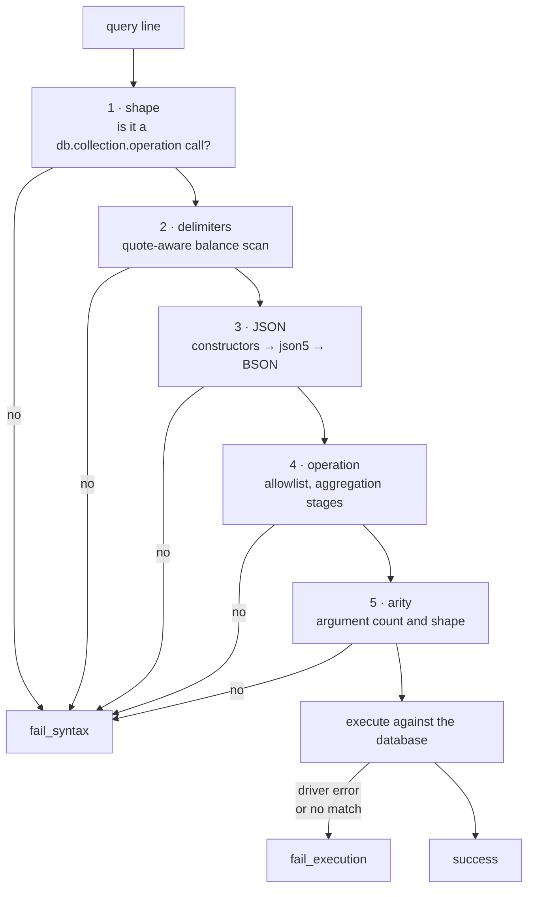

# Query file format

An input file is plain text with one query per line, written in mongosh shell
syntax - exactly what someone would type at a `mongosh` prompt.

```
// Reprice the Reston listings that are still active
db.properties.find({ "address.city": "Reston", "listing_status": "active" })
db.properties.updateMany({ "address.city": "Reston" }, { "$inc": { "listing_price": 5000 } })
db.properties.aggregate([{ "$match": { "address.state": "VA" } }, { "$group": { "_id": "$address.city", "n": { "$sum": 1 } } }])
```

Blank lines and lines beginning with `//` or `#` are skipped, not failed. A
comment in a query file is a note from whoever wrote it; failing the file over
one would just teach people to strip the notes out.

A trailing semicolon is accepted. So are the things people actually type that
strict JSON rejects: unquoted keys, single-quoted strings, a trailing comma.

## Grammar

```
db.<collection>.<operation>(<arguments>)
db.<collection>.find(<filter>).sort(<document>).limit(<n>)
```

`.sort()` and `.limit()` may be chained onto `find`, in either order.

Shell constructors are understood and converted to real BSON types:

| Written | Becomes |
|---|---|
| `ObjectId("64b7f1c2e1b2c3d4e5f60718")` | `ObjectId` |
| `ISODate("2026-01-15T00:00:00Z")`, `new Date(...)` | `datetime` |
| `NumberDecimal("450000.00")` | `Decimal128` |
| `NumberLong(...)`, `NumberInt(...)` | 64-bit / 32-bit integer |

## The two kinds of failure

| Status | Means | Example |
|---|---|---|
| `fail_syntax` | The line was rejected before the database was contacted | A missing brace, an operation that is not permitted |
| `fail_execution` | The line was well formed and the database refused it or matched nothing | An update whose filter matches no document |

The distinction is the point of the design. `fail_syntax` is a mistake in the
file. `fail_execution` means the file disagrees with the data - which is a
different problem with a different fix.

**A single failed line fails the whole file.** The file moves to the `-failed`
bucket in its entirety. The report names the line number, the line, the stage
that rejected it and why, so the file can be corrected and resubmitted rather
than reconstructed.

## The five checks, in order

Each runs only if the one before it passed.



### 1. Shape

The line must be a `db.<collection>.<operation>(` call. Anything else - a stray
SQL statement, a bare function call - is rejected here.

### 2. Delimiters

A quote-aware walk that balances `{}`, `[]` and `()`, tracking where each one
opened. Braces inside string values are text, not structure.

This runs **before** the JSON parse, and the ordering is the whole point. Hand
a JSON parser a line with a missing brace and it reports that input ended
unexpectedly, which tells the reader nothing about where the mistake is. This
scan knows:

```
db.properties.find({ "bedrooms": 4
                   ^
unbalanced '{' opened at col 20
```

When delimiters are mismatched rather than missing, it names both ends:

```
'{' opened at col 37 is closed by ')' (col 58)
```

The unclosed delimiter reported is the innermost one. On the common mistake -
forgetting a closing brace inside a call - the outermost opener is the call's
own parenthesis, which is not where the problem is.

### 3. JSON

Three passes. Shell constructors are rewritten to extended JSON first, since
`ObjectId("...")` is a function call no JSON parser will take. Then json5
handles the loose syntax people write. Then `bson.json_util` turns the
extended-JSON forms into genuine BSON values, so the executor hands the driver
the types it expects.

The constructor rewrite is quote-aware: `"created via ObjectId(\"x\")"` stays a
string, because that is what it is.

### 4. Operation allowlist

| Permitted | |
|---|---|
| Operations | `find`, `insertOne`, `insertMany`, `updateOne`, `updateMany`, `deleteOne`, `deleteMany`, `aggregate` |
| Aggregation stages | `$match`, `$group`, `$sort`, `$project`, `$limit`, `$lookup` (simple `localField`/`foreignField` form only) |
| Chained calls | `.sort()`, `.limit()`, on `find` only |
| Update operators | `$set`, `$unset`, `$inc`, `$mul`, `$min`, `$max`, `$rename`, `$currentDate`, `$push`, `$pull`, `$pullAll`, `$addToSet`, `$pop`, `$setOnInsert` |

This is a compatibility control, not a security one. Local development runs
against MongoDB, which implements considerably more than DocumentDB does.
Without the list, a query using a MongoDB-only feature would pass locally and
fail in QA.

Several stages are rejected by name so the message says why rather than merely
that they are not on a list:

| Stage | Why |
|---|---|
| `$graphLookup` | Recursive graph lookups are not supported by DocumentDB |
| `$text` | Text search is not supported by DocumentDB |
| `$geoNear` | Geospatial queries are not supported by DocumentDB |
| `$unionWith` | Not supported by DocumentDB |
| `$merge`, `$out` | Write to another collection, outside this pipeline's scope |
| `$where` | Executes JavaScript server-side; unsupported, and it would let a query file run arbitrary code |

### 5. Arity and shape

Argument counts, and the rules that make an operation mean what its author
intended. Two are worth calling out because they exist to prevent damage rather
than to enforce tidiness:

**An update must use update operators.**

```
db.properties.updateOne({ "property_id": "PROP-1" }, { "listing_status": "sold" })
```

MongoDB accepts this and it does not do what it looks like: the matched
document is *replaced* wholesale by `{ "listing_status": "sold" }` and every
other field is gone. Rejected, with the offending field named.

**A delete must have a filter.**

```
db.properties.deleteMany({})
```

Valid, and it empties the collection. In production that is a data-loss event
dressed up as a query, so it is refused rather than arrived at by leaving a
filter out.

## Testing

The parser and validator have no I/O at all - no database, no S3, no
filesystem. That is deliberate: the part of the system most likely to need a
new rule is also the cheapest to test.

```bash
# variable form
cd $PROJECT_ROOT && .venv/bin/python -m pytest

# expanded
cd ~/Documents/PROJECTS/mongo-dcu-pipeline && .venv/bin/python -m pytest
```
