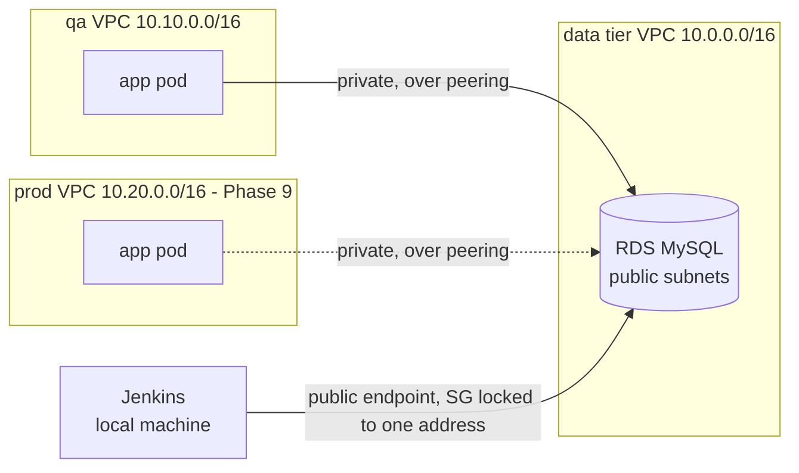

# RDS MySQL

One `db.t3.micro` instance holding run history and promotion tokens for **both**
qa and prod, in a VPC of its own.

## Variables used on this page

```bash
export PROJECT=mongo-dcu-pipeline
export AWS_REGION=us-east-1
export RDS_HOST=$(terraform -chdir=terraform/environments/shared-data output -raw rds_address)
export RDS_USER=dcuadmin
export RDS_DB=mongo_dcu
```

| Variable | Example value | Where it comes from |
|---|---|---|
| `PROJECT` | `mongo-dcu-pipeline` | Fixed |
| `AWS_REGION` | `us-east-1` | Fixed |
| `RDS_USER` | `dcuadmin` | Fixed. Not `admin`, which RDS reserves for MySQL |
| `RDS_DB` | `mongo_dcu` | Fixed. The schema holding the three tables |

**Generated, not chosen:**

| Value | Example shape | How it is produced |
|---|---|---|
| `RDS_HOST` | `mongo-dcu-pipeline-rds.cypgou004zcv.us-east-1.rds.amazonaws.com` | AWS assigns the middle portion at creation. `terraform -chdir=terraform/environments/shared-data output -raw rds_address` |
| Master password | 32 characters | `random_password` at apply time, stored in Secrets Manager under `mongo-dcu-pipeline/shared/rds` |
| `admin_cidr` | `108.45.138.62/32` | Your current public address, detected at apply time. **Changes when your ISP reassigns it** |

## Why it is in its own stack

Three stacks, three lifecycles, and this one sits between the other two:

| Stack | Holds | Lifecycle | Cost |
|---|---|---|---|
| `shared` | ECR repository, analytics bucket | Permanent | A few cents a month |
| `shared-data` | This VPC and this instance | Session-scoped | ~$0.02/hr |
| `qa` / `prod` | VPC, DocumentDB, buckets, secrets, IAM | Session-scoped, destroyed independently | ~$0.14/hr each |

It is **not in `qa`** because qa is destroyed at the end of every session, and
that destroy would take prod's run history and every outstanding promotion
token with it.

It is **not in `shared`** because an RDS instance left running the way the
registry is left running costs $12 a month. Splitting them means each stack is
either permanent and free, or session-scoped and billable, and neither is both.

## How everything reaches it



The pods have no internet route at all - no NAT gateway exists - so they reach
MySQL by private address over a VPC peering connection. Jenkins runs on a
laptop outside AWS and reaches the public endpoint. Three security group rules,
everything else denied:

| Source | Why |
|---|---|
| `<your address>/32` | Jenkins, for the promotion-token check in `-07-promote-to-prod` |
| `10.10.0.0/16` | qa pods, over peering |
| `10.20.0.0/16` | prod pods, over peering. Present from the start - a rule naming a range with no VPC behind it grants nothing |

### The peering detail that is easy to miss

A peering connection alone is not enough. Without
`allow_remote_vpc_dns_resolution`, a pod resolving the RDS hostname gets the
instance's **public** address, and the qa VPC has no internet gateway - so the
connection times out against a peering link that is up, correct, and
blameless. The option makes the hostname resolve to the private address on the
peered side.

The return route matters too, and it goes in the data tier's **public** route
table, because that is where the RDS instance's subnets are. Putting it in the
private table produces the same symptom: an active peering connection and a
connection that hangs.

## Schema

Three tables, per §7. Every row carries an `environment` column, which is what
makes one shared instance worth having - qa and prod history compared in a
single query rather than a join across two databases.

```
runs                 one row per file processed, with file_hash,
                     promotion_token, token_expires_at, token_used
run_lines            one row per line in the file, with status and error
email_notifications  one row per SES message sent
```

DDL is in `sql/schema.sql`. Applied by the Ansible bootstrap playbook in
Phase 7; until then, by hand.

## Connecting

```bash
# variable form
mysql -h $RDS_HOST -P 3306 -u $RDS_USER -p $RDS_DB

# expanded
mysql -h mongo-dcu-pipeline-rds.cypgou004zcv.us-east-1.rds.amazonaws.com \
      -P 3306 -u dcuadmin -p mongo_dcu
```

The password comes from Secrets Manager, not from your memory:

```bash
# variable form
aws secretsmanager get-secret-value --secret-id $PROJECT/shared/rds \
  --region $AWS_REGION --query SecretString --output text | jq -r .password

# expanded
aws secretsmanager get-secret-value --secret-id mongo-dcu-pipeline/shared/rds \
  --region us-east-1 --query SecretString --output text | jq -r .password
```

No client installed? The instance is reachable, which is the part worth
checking:

```bash
# variable form
timeout 5 bash -c "cat < /dev/null > /dev/tcp/$RDS_HOST/3306" && echo reachable

# expanded
timeout 5 bash -c 'cat < /dev/null > /dev/tcp/mongo-dcu-pipeline-rds.cypgou004zcv.us-east-1.rds.amazonaws.com/3306' && echo reachable
```

## When a connection from Jenkins stops working

Check the admin address first. A home address is dynamic, and an ISP
reassignment leaves a security group rule pointing at an address that is no
longer yours:

```bash
terraform -chdir=terraform/environments/shared-data output admin_cidr
curl -s https://checkip.amazonaws.com
```

If they differ, reapply the stack - the address is redetected at apply time -
or set `admin_cidr` explicitly and apply.

## Cost

`db.t3.micro` at ~$0.017/hr plus 20 GB of gp3 at $0.115/GB-month, about
$0.02/hr all in. Storage is billed whether or not the instance is running,
which is one more reason the stack is destroyed rather than stopped: a stopped
RDS instance still bills for storage and restarts itself after seven days.
