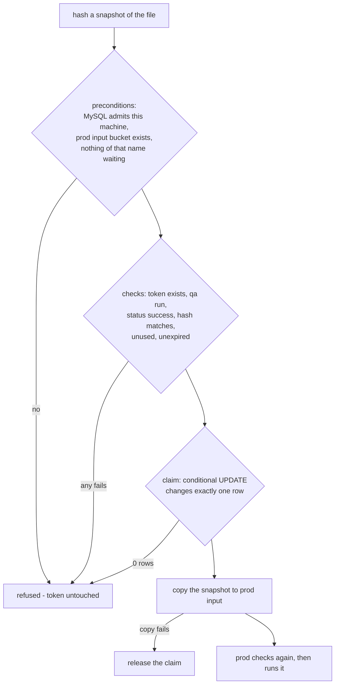

# Runbook - promote a file to prod

A file reaches prod only after a byte-identical, fully successful qa run, and
only through that run's token: once, before it expires. This page is the
procedure, what each refusal means, and what to do about it.

## Variables used on this page

```bash
export PROJECT_ROOT=~/Documents/PROJECTS/mongo-dcu-pipeline
export PROJECT=mongo-dcu-pipeline
export AWS_REGION=us-east-1
export ACCOUNT_ID=$(aws sts get-caller-identity --query Account --output text)
export FILE=samples/all-good.txt
export TOKEN=d3f83d2899acc00b
```

| Variable | Example value | Where it comes from |
|---|---|---|
| `PROJECT_ROOT` | `~/Documents/PROJECTS/mongo-dcu-pipeline` | Wherever you cloned the repository |
| `PROJECT` | `mongo-dcu-pipeline` | Fixed |
| `AWS_REGION` | `us-east-1` | Fixed |
| `ACCOUNT_ID` | `950639281723` | From `aws sts get-caller-identity` |
| `FILE` | `samples/all-good.txt` | Your choice: the file that passed qa, **exactly as it was submitted** |
| `TOKEN` | `d3f83d2899acc00b` | **Generated** by the qa run, never chosen. The qa success email, either qa report, or the `runs` table |

## Before you promote

- The file passed qa **in full** - status `success`, every line. A file with one
  failed line gets no token.
- You have the **same bytes**. Not a copy re-saved by an editor that changed the
  line endings, not a version with one query tidied up. The gate compares
  SHA-256, and a changed byte is a different file.
- The token is **less than 24 hours old** and has **not been used**.
- prod is up: `./scripts/status.sh` lists the `mongo-dcu-pipeline-prod` cluster.
- Your address has not changed since the data tier was applied - MySQL admits
  one address, and the gate is checked from this machine. `promote.sh` checks
  this first.

## Promote

Dry run first. It runs every check and changes nothing:

```bash
# variable form
cd $PROJECT_ROOT
./scripts/promote.sh --file $FILE --token $TOKEN --dry-run

# expanded
cd ~/Documents/PROJECTS/mongo-dcu-pipeline
./scripts/promote.sh --file samples/all-good.txt --token d3f83d2899acc00b --dry-run
```

Then for real. It asks for confirmation; `--yes` answers it, and is required
when there is no terminal:

```bash
# variable form
./scripts/promote.sh --file $FILE --token $TOKEN

# expanded
./scripts/promote.sh --file samples/all-good.txt --token d3f83d2899acc00b
```

What it does, in order:



The token is claimed **before** the copy, so two promotions racing on one token
cannot both get through. The copy is made from the same snapshot that was
hashed, so the file cannot change between the check and the copy.

## After promoting

Prod picks the file up within one polling cycle (20 seconds):

```bash
# variable form
aws s3 ls s3://$PROJECT-prod-successful-$ACCOUNT_ID/
aws s3 ls s3://$PROJECT-prod-failed-$ACCOUNT_ID/
kubectl --context $PROJECT-prod -n prod logs deploy/$PROJECT-app | grep -E 'prod run authorised|run finished' | tail -n 2

# expanded
aws s3 ls s3://mongo-dcu-pipeline-prod-successful-950639281723/
kubectl --context mongo-dcu-pipeline-prod -n prod logs deploy/mongo-dcu-pipeline-app | grep -E 'prod run authorised|run finished' | tail -n 2
```

A prod success email arrives naming the qa run it was promoted from.

**The token is spent whether or not prod's run succeeds.** A prod run that
fails at execution has applied its successful lines; it cannot be rerun, and
that is deliberate.

## When the gate refuses

Every failing check is printed, not just the first. Nothing is claimed and
nothing is copied.

| Printed | Means | Do |
|---|---|---|
| `token: no run carries this token` | Mistyped, or from a different data tier - the run history is destroyed with the data tier at the end of every session | Copy the token again from the email or report. If the data tier has been rebuilt since, run the file through qa again |
| `environment: the token belongs to a prod run` | Not a qa token | Use the token from the qa run |
| `status: ... ended failed` | The qa run did not succeed | Fix the file from the qa report and resubmit to qa |
| `hash: ... the file has changed since it passed` | Not the same bytes | Find the exact file that passed, or run the edited one through qa for a new token |
| `used: the token has already promoted a file` | Replay | Nothing to do if it was already promoted. Check prod's buckets |
| `expired: the token expired at ...` | Over 24 hours old | Run the file through qa again (reseed qa first if its writes change what they match) |
| `MySQL admits X but this machine is now Y` | Your public address changed | `terraform -chdir=$PROJECT_ROOT/terraform/environments/shared-data apply`, which re-detects it |
| `... does not exist - prod is not up` | No prod | Bring prod up. The token was not touched |
| `... is already waiting to be processed` | A file of that name is in prod's input | Wait for prod to pick it up |
| `claim refused` | Used or expired between the check and the claim - almost certainly a second promotion at the same moment | Check prod's buckets. Do not retry with the same token |

## When prod refuses

The gate passing does not mean prod runs the file. Prod checks run history for
itself before executing anything, and routes a refused file to its failed
bucket with status `refused`, a report and an email:

| `refusal_reason` begins | Means |
|---|---|
| `this file has already run in prod` | Any earlier prod run of these bytes - succeeded, failed, or interrupted part way. A file runs in prod once |
| `no promotion authorises this file` | No qa run of these bytes had its token used. The file was put in prod's bucket some other way than `promote.sh` |

If prod cannot read run history at all, it refuses to decide: the file stays in
the input bucket and is retried every polling cycle, with `could not read run
history` in the log. Restore MySQL connectivity; nothing else is needed.

## When the copy fails

`promote.sh` releases the claim, so the same token works again once the cause
is fixed. If the release **also** fails it says so, naming the token. Reset it by
hand - only after confirming the file is not in prod's input bucket:

```bash
MYSQL_SECRET=$(aws secretsmanager get-secret-value --secret-id $PROJECT/shared/rds \
  --region $AWS_REGION --query SecretString --output text) \
.venv/bin/python -c '
import json, os, sys, pymysql
s = json.loads(os.environ["MYSQL_SECRET"])
c = pymysql.connect(host=s["host"], user=s["username"], password=s["password"], database=s["database"], autocommit=True)
print(c.cursor().execute("UPDATE runs SET token_used = FALSE WHERE promotion_token = %s", (sys.argv[1],)), "row released")
' $TOKEN
```

## Never

- **Copy a file into prod's input bucket by hand.** Prod will refuse it - but
  the point of the gate is that nobody tries.
- **Edit a token's expiry or used flag** except to release a claim whose copy
  failed.
- **Re-promote a file that failed in prod.** Some of its lines ran. Write a new
  file that corrects the data, and send that through qa.
